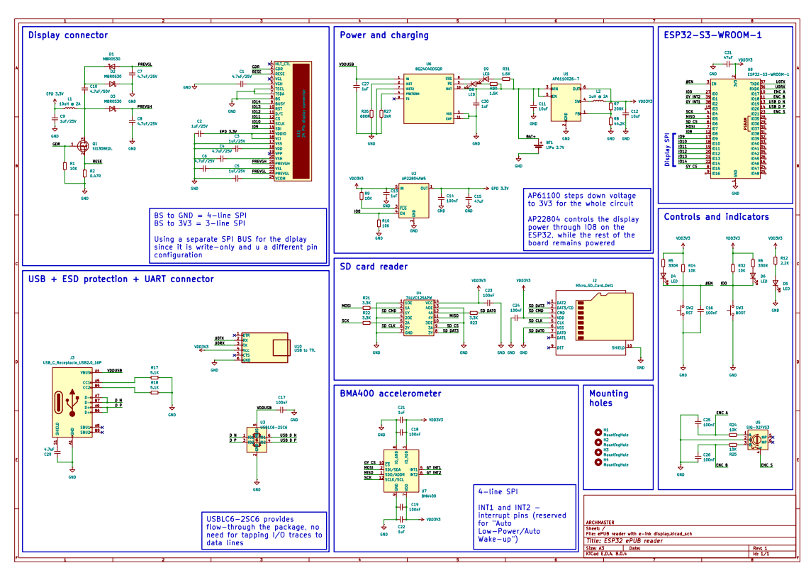

# 📖 ePUB Reader with E-Ink Display

A **compact handheld device** designed for reading books in **ePUB format**, powered by an **ESP32** and featuring an **e-ink display** for a paper-like reading experience.  
It includes **native USB file transfer**, an **SD card slot**, **Li-Po battery power**, and a **rotary encoder** for smooth navigation.  

---

## ✨ Features
- ✅ Supports **ePUB format**
- ✅ **Native USB** file transfer for loading books
- ✅ **SD card storage** for your library
- ✅ Powered by a **Li-Po battery** for portability
- ✅ **Compact PCB** with custom design
- ✅ **Rotary encoder** for intuitive UI control
- ✅ Designed with **KiCAD**, **Fusion 360**, and **VS Code**

---

## 📂 Repository Contents
- `/docs` → PDF schematic, PCB outline, and component placement  
- `/firmware` → ESP32 firmware code  
- `/3d` → Fusion 360 exports (STEP/STL, optional)  
- `/images` → Project renders, schematics, and board previews  

---

## 🖼️ Project Gallery

### 📱 Device Concept Render

### 📐 Schematic

### 🖤 PCB Layout
**Top view**  
  

**Bottom view**  

### 🛠️ 3D PCB Render

---

## 🚀 How to Use
1. Open `/docs` to view the circuit schematic, PCB outline, and component placement.  
2. Replicate the PCB design using the provided documentation.  
3. Build and flash the firmware in **VS Code (ESP-IDF)** or **Arduino IDE** for the ESP32.  
4. Upload your favorite books via USB or SD card.  
5. Enjoy reading on your **custom-built ePUB reader** 📚✨  

---

## 🎯 Purpose
This is a **personal build project** intended as a DIY hardware showcase.  
The schematic and PCB layout are provided **for reference and inspiration only**.  

---
